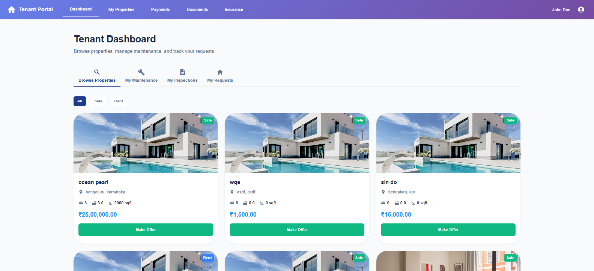
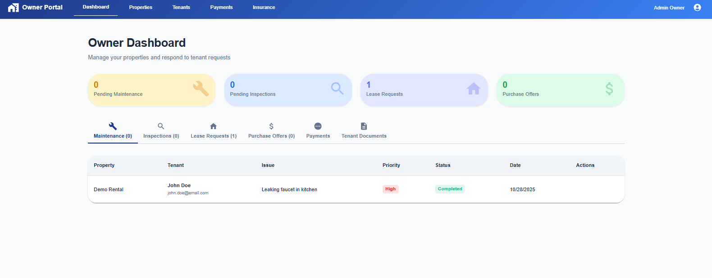

# 🏢 Real Estate Portfolio Management System

A comprehensive dual-portal property management system built with React, Node.js, Express, and MySQL. This DBMS project provides separate interfaces for property owners and tenants with real-time synchronization and complete property lifecycle management.

---

## 👥 Collaborators

- **Chinthan K**  
  SRN: PES2UG23CS155

- **Christananda B**  
  SRN: PES2UG23CS158

---

## 📋 Table of Contents

- [Overview](#overview)
- [System Architecture](#system-architecture)
- [Features](#features)
- [Technology Stack](#technology-stack)
- [Database Schema](#database-schema)
- [Project Structure](#project-structure)
- [Installation & Setup](#installation--setup)
- [Usage](#usage)
- [API Endpoints](#api-endpoints)
- [Screenshots](#screenshots)
- [Future Enhancements](#future-enhancements)

---

## 🎯 Overview

The Real Estate Portfolio Management System is a full-stack web application designed to streamline property management operations. It features dual portals - one for property owners and one for tenants - each with role-specific functionalities and secure authentication.

### Key Highlights

- 🏠 **Dual Portal System**: Separate interfaces for owners and tenants
- 🔐 **Secure Authentication**: JWT-based authentication with bcrypt password hashing
- 💰 **Financial Management**: Track payments, transactions, and rental income
- 🔧 **Maintenance Tracking**: Submit and manage maintenance requests
- 📊 **Real-time Notifications**: Stay updated on property activities
- 📄 **Document Management**: Upload and manage property-related documents
- 🔍 **Property Inspections**: Schedule and track property inspections
- 🛡️ **Insurance Management**: Handle property insurance policies and offers

---

## 🏗️ System Architecture

### High-Level Architecture

```
┌─────────────────────────────────────────────────────────────┐
│                     Landing Page (/)                         │
│              Choose Your Portal                              │
└─────────────────┬─────────────────┬─────────────────────────┘
                  │                 │
         ┌────────┴────────┐ ┌─────┴──────────┐
         │  Owner Portal   │ │  Tenant Portal │
         │   (Blue Theme)  │ │ (Purple Theme) │
         └────────┬────────┘ └─────┬──────────┘
                  │                 │
         ┌────────▼────────┐ ┌─────▼──────────┐
         │   Owner Login   │ │  Tenant Login  │
         │  /owner/signin  │ │/tenant/signin  │
         └────────┬────────┘ └─────┬──────────┘
                  │                 │
         ┌────────▼────────┐ ┌─────▼──────────┐
         │ Owner Dashboard │ │Tenant Dashboard│
         └────────┬────────┘ └─────┬──────────┘
                  │                 │
    ┌─────────────▼─────────────┐   │
    │  Owner Features:          │   │
    │  • Manage Properties      │   │
    │  • View All Tenants       │   │
    │  • All Maintenance Reqs   │   │
    │  • All Payments           │   │
    │  • Inspections            │   │
    │  • Insurance Offers       │   │
    │  • Documents              │   │
    └───────────────────────────┘   │
                                    │
                        ┌───────────▼────────────┐
                        │  Tenant Features:      │
                        │  • My Properties       │
                        │  • Submit Maintenance  │
                        │  • Make Payments       │
                        │  • View Insurance      │
                        │  • Lease Requests      │
                        │  • View My History     │
                        └────────────────────────┘
```

### Component Architecture

```
┌─────────────────────────────────────────────────────────────┐
│                      Frontend (React)                        │
│  ┌────────────┐  ┌─────────────┐  ┌──────────────┐         │
│  │   Pages    │  │ Components  │  │    Utils     │         │
│  │            │  │             │  │              │         │
│  │ - Home     │  │ - Navbar    │  │ - Currency   │         │
│  │ - Owner/*  │  │ - Portal    │  │ - Auth       │         │
│  │ - Tenant/* │  │   Navbar    │  │ - Helpers    │         │
│  │ - Dashboard│  │ - Footer    │  │              │         │
│  └────────────┘  └─────────────┘  └──────────────┘         │
└─────────────────────────┬───────────────────────────────────┘
                          │ REST API (Axios)
                          │
┌─────────────────────────▼───────────────────────────────────┐
│                   Backend (Express.js)                       │
│  ┌────────────────────────────────────────────────────────┐ │
│  │                  API Routes                            │ │
│  │  /auth  /properties  /tenants  /leases  /maintenance  │ │
│  │  /payments  /insurance  /inspections  /documents      │ │
│  └────────────────────────┬───────────────────────────────┘ │
│                           │                                  │
│  ┌────────────────────────▼───────────────────────────────┐ │
│  │              Middleware & Controllers                  │ │
│  │  • Authentication (JWT)                                │ │
│  │  • Request Validation                                  │ │
│  │  • Error Handling                                      │ │
│  └────────────────────────┬───────────────────────────────┘ │
└───────────────────────────┼─────────────────────────────────┘
                            │ MySQL2 (Connection Pool)
                            │
┌───────────────────────────▼─────────────────────────────────┐
│                    Database (MySQL)                          │
│  ┌──────────────────────────────────────────────────────┐   │
│  │  Tables: Owner, Tenant, Property, Lease, Payment,   │   │
│  │  Maintenance_Request, Insurance, Notification, etc.  │   │
│  └──────────────────────────────────────────────────────┘   │
│  ┌──────────────────────────────────────────────────────┐   │
│  │  Stored Procedures, Functions, Triggers, Views       │   │
│  └──────────────────────────────────────────────────────┘   │
└─────────────────────────────────────────────────────────────┘
```

### Data Flow Example: Maintenance Request

```
TENANT CREATES MAINTENANCE REQUEST:
┌──────────┐     ┌──────────────┐     ┌──────────────┐     ┌──────────┐
│ Tenant   │────▶│   Backend    │────▶│   Database   │────▶│  Owner   │
│ Portal   │     │ /maintenance │     │ + Notification│     │  Portal  │
└──────────┘     └──────────────┘     └──────────────┘     └──────────┘
   Submit            Save to DB        Create Owner         Sees new
   Request           + Create          Notification         request
                     Notification      Record               immediately

OWNER UPDATES MAINTENANCE STATUS:
┌──────────┐     ┌──────────────┐     ┌──────────────┐     ┌──────────┐
│  Owner   │────▶│   Backend    │────▶│   Database   │────▶│  Tenant  │
│ Portal   │     │ PUT /maint   │     │ + Notification│     │  Portal  │
└──────────┘     └──────────────┘     └──────────────┘     └──────────┘
   Update           Update Status      Create Tenant        Sees status
   Status           in DB              Notification         update
```

---

## ✨ Features

### Owner Portal Features

- ✅ **Property Management**
  - Add, edit, and delete properties
  - Support for regular properties and accommodations
  - Property status tracking (Available, Occupied, Under Maintenance)
  - Upload property images and documents

- ✅ **Tenant Management**
  - View all tenants across properties
  - Track tenant details, credit scores, and employment status
  - Manage tenant leases and rental agreements

- ✅ **Financial Management**
  - Track all rental payments
  - View payment history and pending payments
  - Monitor financial transactions
  - Generate revenue reports

- ✅ **Maintenance Management**
  - View all maintenance requests
  - Assign maintenance tasks
  - Update request status and costs
  - Track completion dates

- ✅ **Insurance Management**
  - Create insurance offers for tenants
  - Manage property insurance policies
  - Track insurance coverage and premiums

- ✅ **Inspection Management**
  - Schedule property inspections
  - Record inspection results
  - Track inspection history

### Tenant Portal Features

- ✅ **Property Browsing**
  - View available properties for rent/lease
  - Filter properties by type, location, price
  - View detailed property information
  - Request property viewings

- ✅ **Lease Management**
  - Submit lease requests
  - View current and past leases
  - Track lease terms and conditions

- ✅ **Payment Portal**
  - Make rental payments
  - View payment history
  - Track upcoming payment due dates
  - View payment receipts

- ✅ **Maintenance Requests**
  - Submit maintenance requests
  - Track request status
  - View maintenance history
  - Add priority levels and descriptions

- ✅ **Insurance Portal**
  - View insurance offers from owners
  - Accept or decline insurance coverage
  - Track insurance policies

- ✅ **Notifications**
  - Real-time notifications for:
    - Maintenance request updates
    - Payment confirmations
    - Lease approvals
    - Insurance offers

---

## 🛠️ Technology Stack

### Frontend
- **React 18.2.0** - UI library
- **TypeScript 4.9.5** - Type-safe JavaScript
- **Material-UI (MUI) 5.14.9** - Component library
- **React Router 6.15.0** - Client-side routing
- **Axios 1.5.0** - HTTP client
- **Emotion** - CSS-in-JS styling

### Backend
- **Node.js** - JavaScript runtime
- **Express 4.18.2** - Web framework
- **MySQL2 3.6.1** - Database driver
- **JWT (jsonwebtoken 9.0.2)** - Authentication
- **Bcrypt 6.0.0** - Password hashing
- **CORS 2.8.5** - Cross-origin resource sharing
- **Express-validator 7.0.1** - Input validation
- **Dotenv 16.3.1** - Environment variables

### Database
- **MySQL 8.0+** - Relational database
- **Stored Procedures** - Complex business logic
- **Triggers** - Automated actions
- **Views** - Simplified queries
- **Functions** - Reusable calculations

### Development Tools
- **Nodemon 3.0.1** - Auto-restart server
- **VS Code** - Code editor
- **Git** - Version control

---

## 🗄️ Database Schema

### Core Tables

1. **Owner** - Property owner information and authentication
2. **Tenant** - Tenant information and authentication
3. **Property** - Property details and specifications
4. **Room** - Room management for PG/Hostel properties
5. **Lease** - Lease agreements and rental contracts
6. **Maintenance_Request** - Maintenance and repair requests
7. **Payment** - Rental payment tracking
8. **Notification** - Real-time user notifications
9. **Insurance_Policy** - Property insurance policies
10. **Insurance_Offer** - Insurance offers from owners to tenants

### Additional Tables

- **Financial_Transaction** - All financial transactions
- **Property_Document** - Property-related documents
- **Property_Inspection** - Inspection records
- **PropertyOwnership** - Ownership history tracking
- **LeaseRequest** - Tenant lease requests
- **PurchaseRequest** - Property purchase requests

### Database Features

- ✅ **Primary Keys** - All tables have auto-incrementing primary keys
- ✅ **Foreign Keys** - Proper relationships with CASCADE/SET NULL
- ✅ **Indexes** - Optimized queries on status and date columns
- ✅ **Triggers** - Automated notifications and status updates
- ✅ **Stored Procedures** - Complex business logic
- ✅ **Views** - Simplified data access
- ✅ **Functions** - Reusable calculations
- ✅ **3NF Compliance** - Normalized database design

---

## 📁 Project Structure

```
dbms-project/
│
├── README.md
├── SYSTEM_ARCHITECTURE.md
├── package-lock.json
│
├── backend/
│   ├── package.json
│   ├── server.js
│   ├── server_updated.js
│   │
│   ├── config/
│   │   └── database.js              # MySQL connection pool
│   │
│   ├── database/
│   │   ├── schema.sql               # Complete database schema
│   │   ├── init.sql                 # Database initialization
│   │   ├── procedures.sql           # Stored procedures
│   │   ├── functions.sql            # User-defined functions
│   │   ├── triggers.sql             # Database triggers
│   │   ├── views.sql                # Database views
│   │   ├── aggregate_queries.sql    # Complex aggregate queries
│   │   ├── nested_queries.sql       # Nested/subquery examples
│   │   ├── sample_queries.sql       # Sample queries
│   │   ├── routes_aggregate_queries.sql
│   │   └── routes_join_queries.sql
│   │
│   ├── routes/
│   │   ├── auth.js                  # Authentication routes
│   │   ├── properties.js            # Property management
│   │   ├── tenants.js               # Tenant management
│   │   ├── owners.js                # Owner management
│   │   ├── leases.js                # Lease management
│   │   ├── maintenance.js           # Maintenance requests
│   │   ├── payments.js              # Payment processing
│   │   ├── transactions.js          # Financial transactions
│   │   ├── insurance.js             # Insurance management
│   │   ├── inspections.js           # Property inspections
│   │   ├── documents.js             # Document management
│   │   └── rooms.js                 # Room management (PG)
│   │
│   └── scripts/
│       ├── init-database.js         # Database setup script
│       └── seed-minimal.js          # Seed sample data
│
├── frontend/
│   ├── package.json
│   │
│   ├── public/
│   │   ├── index.html
│   │   └── setup.html
│   │
│   └── src/
│       ├── App.tsx                  # Main application component
│       ├── App_Old.tsx              # Legacy app component
│       ├── index.tsx                # Application entry point
│       ├── theme.ts                 # MUI theme configuration
│       │
│       ├── components/
│       │   ├── Navbar.tsx           # Navigation bar
│       │   ├── PortalNavbar.tsx     # Portal-specific navbar
│       │   └── Footer.tsx           # Footer component
│       │
│       ├── pages/
│       │   ├── Home.tsx             # Landing page
│       │   │
│       │   ├── OwnerSignin.tsx      # Owner login
│       │   ├── OwnerRegister.tsx    # Owner registration
│       │   ├── OwnerDashboard.tsx   # Owner dashboard
│       │   ├── OwnerPayments.tsx    # Owner payment management
│       │   ├── OwnerInsurance.tsx   # Owner insurance management
│       │   │
│       │   ├── TenantSignin.tsx     # Tenant login
│       │   ├── TenantRegister.tsx   # Tenant registration
│       │   ├── TenantDashboard.tsx  # Tenant dashboard
│       │   ├── TenantProperties.tsx # Tenant property view
│       │   ├── TenantInsurance.tsx  # Tenant insurance view
│       │   │
│       │   ├── Properties.tsx       # Property management
│       │   ├── Tenants.tsx          # Tenant management
│       │   ├── Leases.tsx           # Lease management
│       │   ├── Maintenance.tsx      # Maintenance requests
│       │   ├── Inspections.tsx      # Property inspections
│       │   ├── Documents.tsx        # Document management
│       │   ├── Insurance.tsx        # Insurance management
│       │   ├── Transactions.tsx     # Financial transactions
│       │   ├── Dashboard.tsx        # General dashboard
│       │   ├── Register.tsx         # General registration
│       │   ├── Signin.tsx           # General signin
│       │   └── Owners.tsx           # Owner management
│       │
│       ├── UPDATED/
│       │   ├── App.tsx
│       │   ├── components/
│       │   │   └── Navbar.tsx
│       │   └── pages/
│       │       ├── Dashboard.tsx
│       │       ├── Leases.tsx
│       │       ├── Maintenance.tsx
│       │       ├── Properties.tsx
│       │       ├── Properties_Enhanced.tsx
│       │       └── Tenants.tsx
│       │
│       └── utils/
│           ├── currency.ts          # Currency formatting
│           └── index.ts             # Utility exports
│
└── first/                           # Additional files/prototypes
```

---

## 🚀 Installation & Setup

### Prerequisites

- **Node.js** (v14 or higher)
- **MySQL** (v8.0 or higher)
- **npm** or **yarn**
- **Git**

### Step 1: Clone the Repository

```bash
git clone <repository-url>
cd dbms-project
```

### Step 2: Database Setup

1. **Create MySQL Database:**
```bash
mysql -u root -p
```

```sql
CREATE DATABASE real_estate_portfolio;
USE real_estate_portfolio;
```

2. **Run Schema and Initialization Scripts:**
```bash
# Run in order:
mysql -u root -p real_estate_portfolio < backend/database/schema.sql
mysql -u root -p real_estate_portfolio < backend/database/init.sql
mysql -u root -p real_estate_portfolio < backend/database/procedures.sql
mysql -u root -p real_estate_portfolio < backend/database/functions.sql
mysql -u root -p real_estate_portfolio < backend/database/triggers.sql
mysql -u root -p real_estate_portfolio < backend/database/views.sql
```

3. **Configure Database Connection:**

Create a `.env` file in the `backend/` directory:

```env
DB_HOST=localhost
DB_USER=root
DB_PASSWORD=your_password
DB_NAME=real_estate_portfolio
DB_PORT=3306
JWT_SECRET=your_jwt_secret_key_here
PORT=5000
```

### Step 3: Backend Setup

```bash
cd backend
npm install
```

**Optional: Seed Sample Data**
```bash
node scripts/init-database.js
node scripts/seed-minimal.js
```

**Start Backend Server:**
```bash
npm start
# or for development with auto-reload:
npm run dev
```

Server will run on `http://localhost:5000`

### Step 4: Frontend Setup

```bash
cd frontend
npm install
```

**Start Frontend Development Server:**
```bash
npm start
```

Frontend will run on `http://localhost:3000`

### Step 5: Build for Production

**Backend:**
```bash
cd backend
npm start
```

**Frontend:**
```bash
cd frontend
npm run build
```

The build folder will contain the optimized production build. You can serve it using the backend server which is configured to serve the React app.

---

## 💻 Usage

### First Time Setup

1. **Access the Landing Page:**
   - Navigate to `http://localhost:3000`
   - Choose between Owner Portal or Tenant Portal

2. **Owner Registration:**
   - Click "Owner Portal"
   - Click "Register" on the signin page
   - Fill in owner details (name, email, password, phone)
   - Login with registered credentials

3. **Add Properties:**
   - Navigate to Properties page
   - Click "Add Property"
   - Fill in property details
   - Upload property images (optional)

4. **Tenant Registration:**
   - Click "Tenant Portal" from landing page
   - Click "Register"
   - Fill in tenant details
   - Login with credentials

5. **Browse and Request Properties:**
   - Tenants can view available properties
   - Submit lease requests
   - Make payments
   - Submit maintenance requests

### Owner Workflow

1. **Dashboard Overview:**
   - View total properties, tenants, revenue
   - See pending maintenance requests
   - Check recent payments

2. **Manage Properties:**
   - Add new properties (regular or PG)
   - Edit property details
   - Update property status
   - Upload documents

3. **Manage Tenants:**
   - View all tenants
   - Check tenant details and credit scores
   - Approve/reject lease requests

4. **Handle Maintenance:**
   - View maintenance requests by property
   - Update request status
   - Assign maintenance tasks
   - Record costs

5. **Process Payments:**
   - View pending payments
   - Confirm received payments
   - Track payment history
   - Generate financial reports

6. **Insurance Management:**
   - Create insurance offers for tenants
   - Manage property insurance policies
   - Track insurance coverage

### Tenant Workflow

1. **Dashboard Overview:**
   - View current property
   - Check upcoming payments
   - See maintenance request status

2. **Property Browsing:**
   - Browse available properties
   - Filter by type, location, price
   - View property details

3. **Lease Management:**
   - Submit lease requests
   - View lease terms
   - Track lease status

4. **Make Payments:**
   - View due payments
   - Submit payment details
   - View payment history

5. **Maintenance Requests:**
   - Submit new requests
   - Add descriptions and priority
   - Track request status
   - View completion updates

6. **Insurance:**
   - View insurance offers
   - Accept/decline coverage
   - Track insurance policies

---

## 🔌 API Endpoints

### Authentication

```
POST   /api/auth/owner/register      - Register new owner
POST   /api/auth/owner/login         - Owner login
POST   /api/auth/tenant/register     - Register new tenant
POST   /api/auth/tenant/login        - Tenant login
```

### Properties

```
GET    /api/properties               - Get all properties
GET    /api/properties/:id           - Get property by ID
POST   /api/properties               - Create new property
PUT    /api/properties/:id           - Update property
DELETE /api/properties/:id           - Delete property
GET    /api/properties/owner/:id     - Get properties by owner
```

### Tenants

```
GET    /api/tenants                  - Get all tenants
GET    /api/tenants/:id              - Get tenant by ID
POST   /api/tenants                  - Create new tenant
PUT    /api/tenants/:id              - Update tenant
DELETE /api/tenants/:id              - Delete tenant
GET    /api/tenants/owner/:id        - Get tenants by owner
```

### Leases

```
GET    /api/leases                   - Get all leases
GET    /api/leases/:id               - Get lease by ID
POST   /api/leases                   - Create new lease
PUT    /api/leases/:id               - Update lease
DELETE /api/leases/:id               - Delete lease
GET    /api/leases/tenant/:id        - Get leases by tenant
GET    /api/leases/property/:id      - Get leases by property
```

### Maintenance

```
GET    /api/maintenance              - Get all maintenance requests
GET    /api/maintenance/:id          - Get request by ID
POST   /api/maintenance              - Create new request
PUT    /api/maintenance/:id          - Update request
DELETE /api/maintenance/:id          - Delete request
GET    /api/maintenance/owner        - Get requests for owner
GET    /api/maintenance/tenant/:id   - Get requests by tenant
```

### Payments

```
GET    /api/payments                 - Get all payments
GET    /api/payments/:id             - Get payment by ID
POST   /api/payments                 - Create new payment
PUT    /api/payments/:id             - Update payment
GET    /api/payments/owner           - Get payments for owner
GET    /api/payments/tenant/:id      - Get payments by tenant
GET    /api/payments/tenant/:id/pending - Get pending payments
GET    /api/payments/owner/stats     - Get payment statistics
```

### Insurance

```
GET    /api/insurance/policies       - Get all insurance policies
GET    /api/insurance/policies/:id   - Get policy by ID
POST   /api/insurance/policies       - Create new policy
PUT    /api/insurance/policies/:id   - Update policy
DELETE /api/insurance/policies/:id   - Delete policy
GET    /api/insurance/offers         - Get all insurance offers
POST   /api/insurance/offers         - Create new offer
PUT    /api/insurance/offers/:id     - Update offer
GET    /api/insurance/offers/tenant/:id - Get offers by tenant
```

### Inspections

```
GET    /api/inspections              - Get all inspections
GET    /api/inspections/:id          - Get inspection by ID
POST   /api/inspections              - Create new inspection
PUT    /api/inspections/:id          - Update inspection
DELETE /api/inspections/:id          - Delete inspection
GET    /api/inspections/property/:id - Get inspections by property
```

### Documents

```
GET    /api/documents                - Get all documents
GET    /api/documents/:id            - Get document by ID
POST   /api/documents                - Upload new document
DELETE /api/documents/:id            - Delete document
GET    /api/documents/property/:id   - Get documents by property
```

### Rooms (PG Management)

```
GET    /api/rooms                    - Get all rooms
GET    /api/rooms/:id                - Get room by ID
POST   /api/rooms                    - Create new room
PUT    /api/rooms/:id                - Update room
DELETE /api/rooms/:id                - Delete room
GET    /api/rooms/property/:id       - Get rooms by property
```

---

## 📸 Screenshots

### Owner Portal
- **Owner Dashboard**: Overview of properties, tenants, and financial metrics


### Tenant Portal
- **Tenant Dashboard**: View current property and notifications


---

## 🔮 Future Enhancements

### Planned Features

- [ ] **Advanced Analytics Dashboard**
  - Revenue forecasting
  - Occupancy rate trends
  - Maintenance cost analysis

- [ ] **Email Notifications**
  - Payment reminders
  - Maintenance updates
  - Lease expiration alerts

- [ ] **Mobile Application**
  - React Native mobile app
  - Push notifications
  - Mobile-optimized UI

- [ ] **Document OCR**
  - Automatic document text extraction
  - Smart document categorization

- [ ] **Advanced Search & Filters**
  - Fuzzy search for properties
  - Multi-criteria filtering
  - Saved search preferences

- [ ] **Payment Gateway Integration**
  - Online payment processing
  - Multiple payment methods
  - Automatic payment reconciliation

- [ ] **Chatbot Support**
  - AI-powered tenant support
  - FAQ automation
  - Maintenance request assistance

- [ ] **Report Generation**
  - PDF financial reports
  - Custom report builder
  - Scheduled report delivery

- [ ] **Multi-language Support**
  - Internationalization (i18n)
  - Multiple language options

- [ ] **Role-Based Access Control**
  - Property managers
  - Maintenance staff
  - Accountants

### Technical Improvements

- [ ] Implement caching (Redis)
- [ ] Add GraphQL API
- [ ] Implement WebSocket for real-time updates
- [ ] Add comprehensive unit and integration tests
- [ ] Docker containerization
- [ ] CI/CD pipeline setup
- [ ] Performance optimization
- [ ] Security audit and enhancements

---

## 📄 License

This project is developed as part of a Database Management Systems (DBMS) course project.

---

## 🤝 Contributing

This is an academic project. For suggestions or improvements, please contact the collaborators.

---

## 📞 Contact

For any queries or support:

- **Chinthan K** - PES2UG23CS155
- **Christananda B** - PES2UG23CS158

---

## 🙏 Acknowledgments

- Course Instructor and Teaching Assistants
- PES University - Department of Computer Science
- Material-UI Team for the excellent component library
- React and Express.js communities

---

**Built with ❤️ by Chinthan K and Christananda B**

